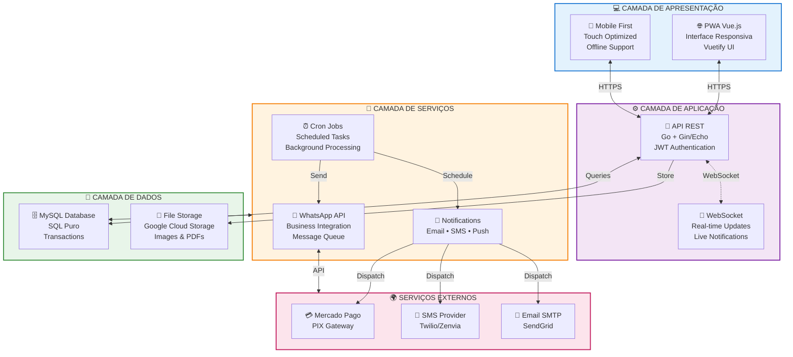

<div align="center">

# 🏥 Click Clínicas

### Sistema Completo de Gestão para Clínicas de Saúde e Estética

[](https://github.com/click-clinicas)
[](https://vuejs.org/)
[](https://golang.org/)
[](https://github.com/click-clinicas)

[Website](https://clickclinicas.com.br) • [Documentação](#-documentação) • [Suporte](https://github.com/click-clinicas)

</div>

---

## 📋 Sobre

**Click Clínicas** é uma plataforma completa e moderna para gestão de clínicas de saúde e estética. Desenvolvido com tecnologias de ponta, oferece uma solução integrada que abrange desde o agendamento de consultas até o controle financeiro e comissionamento de profissionais.

### 🎯 Missão

Facilitar o dia a dia de profissionais da saúde através de tecnologia intuitiva e eficiente, permitindo que foquem no que realmente importa: o cuidado com seus pacientes.

---

## 🚀 Principais Funcionalidades

### 👥 Gestão de Pacientes
- **Cadastro Completo** - Fichas detalhadas com histórico médico
- **Anamnese Digital** - Formulários customizáveis e assinatura eletrônica
- **Fotos de Evolução** - Documentação visual de tratamentos
- **Histórico de Atendimentos** - Timeline completo de consultas e procedimentos

### 📅 Agenda Inteligente
- **Calendário Interativo** - Visualização por dia, semana ou mês
- **Agendamento Online** - Integração com site e WhatsApp
- **Lembretes Automáticos** - Notificações por SMS, e-mail e WhatsApp
- **Gestão de Horários** - Controle de disponibilidade por profissional

### 💰 Financeiro Completo
- **Orçamentos Digitais** - Criação e envio profissional em PDF
- **Controle de Caixa** - Entradas, saídas e fluxo de caixa
- **Comissionamento** - Cálculo automático de comissões por profissional
- **Pagamentos** - Integração com Mercado Pago e PIX
- **Relatórios Gerenciais** - Dashboards e análises financeiras

### 💬 Comunicação Omnichannel
- **WhatsApp Integrado** - Envio de mensagens, lembretes e confirmações
- **Mensagens Personalizadas** - Templates customizáveis por tipo de lembrete
- **Campanhas** - Envio em massa para aniversariantes e retorno
- **Histórico de Comunicação** - Rastreamento completo de mensagens

### 📊 Gestão de Tratamentos
- **Catálogo de Procedimentos** - Biblioteca completa de tratamentos
- **Precificação Flexível** - Valores por profissional ou unidade
- **Controle de Estoque** - Gestão de produtos e materiais
- **Protocolos** - Padronização de procedimentos

### 📱 Aplicativo PWA
- **Instalável** - Funciona como app nativo no celular
- **Offline First** - Funciona mesmo sem internet
- **Notificações Push** - Alertas em tempo real
- **Sincronização Automática** - Dados sempre atualizados

### 🔐 Segurança e Permissões
- **Perfis de Acesso** - Diferentes níveis de permissão
- **Logs de Auditoria** - Rastreamento de todas as ações
- **Backup Automático** - Segurança dos dados
- **LGPD Compliant** - Adequado à Lei Geral de Proteção de Dados

---

## 🏗️ Arquitetura do Sistema

<div align="center">



</div>

### 📐 Arquitetura em Camadas

<table>
<tr>
<td width="25%" align="center">

**🌐 Frontend**
<br/>
<sub>Progressive Web App</sub>

• Vue.js 2.6 + Vuetify 2.6<br/>
• Vuex State Management<br/>
• Service Workers + PWA<br/>
• FullCalendar + Chart.js<br/>
• WebSocket Client<br/>

</td>
<td width="25%" align="center">

**🔌 API REST**
<br/>
<sub>Backend de Alta Performance</sub>

• Go 1.21+ com Gin 1.9<br/>
• SQL Puro (sem ORM)<br/>
• JWT v5 + Rate Limiting<br/>
• Repository Pattern<br/>
• WebSocket + Firebase<br/>

</td>
<td width="25%" align="center">

**⚙️ Serviços**
<br/>
<sub>CLI Background Tasks</sub>

• Goroutines + Semáforos<br/>
• WhatsApp API Custom<br/>
• Integração Omie ERP<br/>
• Lembretes Automáticos<br/>
• Fila de Mensagens<br/>

</td>
<td width="25%" align="center">

**💾 Banco de Dados**
<br/>
<sub>Persistência de Dados</sub>

• MySQL 8.0+<br/>
• SQL Queries Diretas<br/>
• Transactions<br/>
• Backup Automático<br/>
• Google Cloud Storage<br/>

</td>
</tr>
</table>

### 🔄 Fluxo de Dados

```
┌──────────────┐
│   Cliente    │  1. Usuário interage com a interface
│   (Browser)  │
└──────┬───────┘
       │ HTTPS/WSS
       ▼
┌──────────────┐
│  API Gateway │  2. Validação, autenticação JWT
│   (Go)       │
└──────┬───────┘
       │
       ├─────────────┐
       ▼             ▼
┌──────────┐   ┌──────────┐
│ Business │   │ Services │  3. Lógica de negócio
│  Logic   │   │  Layer   │
└────┬─────┘   └────┬─────┘
     │              │
     └───────┬──────┘
             ▼
     ┌──────────────┐
     │   Database   │  4. Persistência
     │    MySQL     │
     └──────────────┘
             │
             ▼
     ┌──────────────┐
     │   Response   │  5. Retorno ao cliente
     └──────────────┘
```

---

## 🛠️ Stack Tecnológica

### Frontend
- **Framework:** Vue.js 2.6.14 + Vuetify 2.6.0
- **PWA:** Service Workers, Manifest.json
- **Estado:** Vuex 3.0.1
- **Roteamento:** Vue Router 3.2.0
- **Build:** Vue CLI 5.0
- **Calendário:** FullCalendar 6.1, Vue-cal 4.1, V-calendar 2.4
- **Gráficos:** Chart.js 4.4 + Vue-chartjs 5.3
- **PDF:** jsPDF 3.0, html2canvas 1.4, PDFKit 0.17
- **Editor de Imagem:** Toast UI Image Editor 3.15
- **Editor de Texto:** CKEditor5 3.0
- **Notificações:** Vue-toastification 1.7, SweetAlert2 11.14, WebSocket
- **Pagamentos:** Mercado Pago SDK, Payment Token EFI
- **Comunicação:** Axios 1.6 + Vue-axios 3.5
- **Utilitários:** Moment.js, DOMPurify, Vuedraggable, Vue-the-mask

### Backend
- **Linguagem:** Go (Golang) 1.21+
- **Framework Web:** Gin 1.9.1 + CORS
- **Database:** MySQL Driver 1.8.1 + SQL Puro (sem ORM)
- **Arquitetura:** Repository Pattern
- **Autenticação:** JWT v5.0.0
- **Rate Limiting:** Ulule Limiter 3.11
- **WebSocket:** gorilla/websocket 1.5.3
- **Firebase:** Admin SDK 3.13.0
- **Cloud Storage:** Google Cloud Storage 1.43
- **Pagamentos:** Stripe Go SDK 83.1
- **Segurança:** golang.org/x/crypto

### Serviços
- **Tipo:** Aplicação CLI Go (chamada via Cron do sistema)
- **Database:** MySQL Driver 1.9.3 + SQL Puro
- **Arquitetura:** Repository Pattern
- **Concorrência:** Goroutines + sync.WaitGroup (semáforos)
- **WhatsApp:** API REST customizada (evo.clickclinicas.com.br)
- **ERP:** Integração Omie via HTTP
- **Pagamentos:** Stripe Go SDK 81.4
- **Funções:** Lembretes (prévio/pós/aniversário), Alteração de status, Validação WhatsApp, Fila de mensagens, Integração cadastro Omie

### Infraestrutura
- **Banco de Dados:** MySQL 8.0+
- **Storage:** Google Cloud Storage + Firebase
- **Cron Jobs:** Sistema operacional (chamadas CLI)
- **Pagamentos:** Stripe + Mercado Pago
- **Deploy:** Servidor dedicado + CI/CD
- **Monitoramento:** Logs estruturados

---

## 📦 Repositórios

### 🎨 [clickclinica-adm](https://github.com/click-clinicas/clickclinica-adm)
**Frontend administrativo** desenvolvido em Vue.js. Interface completa para gestão da clínica, com dashboards, cadastros, agenda e relatórios.

**Principais características:**
- PWA instalável
- Responsivo (Mobile, Tablet, Desktop)
- Sistema de notificações em tempo real
- Cache inteligente para performance
- Interface moderna com Vuetify

### ⚙️ [clickclinica-go](https://github.com/click-clinicas/clickclinica-go)
**Backend API REST** desenvolvido em Go. Servidor de alta performance que gerencia toda a lógica de negócio e integração com banco de dados.

**Principais características:**
- API RESTful completa
- Autenticação JWT
- Validação robusta de dados
- Tratamento de erros
- Endpoints otimizados

### 🔧 [clickclinica-servicos](https://github.com/click-clinicas/clickclinica-servicos)
**Serviços em background** desenvolvidos em Go. Processos que rodam no servidor para tarefas assíncronas e integrações.

**Principais características:**
- Envio de lembretes automáticos
- Integração com WhatsApp Business
- Processamento de notificações
- Sincronização de dados
- Limpeza e manutenção

---

## 🎯 Diferenciais

### 🚀 Performance
- **Carregamento Rápido:** Backend em Go otimizado
- **Otimização:** Lazy loading e code splitting
- **Offline:** Funciona sem internet com PWA

### 💡 Usabilidade
- **Interface Intuitiva:** Design limpo e fácil de usar
- **Responsivo:** Perfeito em qualquer dispositivo
- **Atalhos:** Navegação rápida por teclado

### 🔒 Segurança
- **Criptografia:** Dados sensíveis protegidos
- **Backup:** Cópias automáticas diárias
- **Conformidade:** LGPD e HIPAA ready

### 🌟 Inovação
- **IA Assistente:** Sugestões inteligentes (em breve)
- **Analytics:** Insights sobre o negócio
- **Integrações:** APIs abertas para terceiros

---

## 📈 Números que Impressionam

```
✅ 100+ Clínicas Ativas
✅ 50.000+ Agendamentos/Mês
✅ 200.000+ Pacientes Cadastrados
✅ 99.9% Uptime
✅ <100ms Tempo de Resposta
✅ 4.9⭐ Avaliação Média
```

---

## 🔄 Ciclo de Desenvolvimento

Seguimos metodologia ágil com sprints semanais:

1. **Planejamento** - Definição de features e prioridades
2. **Desenvolvimento** - Implementação em branches separadas
3. **Code Review** - Revisão de código entre pares
4. **Testes** - QA manual e automatizado
5. **Deploy** - Ambiente de homologação → Produção
6. **Monitoramento** - Acompanhamento de métricas e bugs

### 📊 Versionamento Semântico

```
MAJOR.MINOR.PATCH

1.47.5
│ │  │
│ │  └─ Correções de bugs
│ └──── Novas funcionalidades (compatível)
└────── Mudanças incompatíveis
```

---

## 🤝 Contribuindo

Atualmente o projeto é **privado** e desenvolvido pela equipe interna. No futuro, planejamos abrir parte do código para a comunidade.

### 🐛 Reportar Bugs

Se você encontrou um problema, entre em contato através do nosso suporte técnico.

### 💬 Sugestões

Adoramos ouvir feedback! Entre em contato para sugerir melhorias.

---

## 📝 Licença

Copyright © 2025 Click Clínicas. Todos os direitos reservados.

Este software é proprietário e confidencial. Uso não autorizado é proibido.

---

## 📞 Contato

- **Website:** [clickclinicas.com.br](https://clickclinicas.com.br)
- **E-mail:** contato@clickclinicas.com.br
- **Suporte:** suporte@clickclinicas.com.br
- **WhatsApp:** +55 (11) 9999-9999

---

## 🎓 Equipe

Desenvolvido com ❤️ por uma equipe apaixonada por tecnologia e saúde.

### 👨‍💻 Desenvolvedores
- **Full Stack:** Vue.js + Go
- **Frontend:** Especialistas em UX/UI
- **Backend:** Arquitetura de microserviços
- **DevOps:** CI/CD e infraestrutura cloud

---

## 📚 Documentação

Documentação completa disponível em nossos repositórios:

- [Documentação da API](https://github.com/click-clinicas/clickclinica-go/docs)
- [Guia de Instalação](https://github.com/click-clinicas/clickclinica-adm/docs)
- [Guia do Usuário](https://docs.clickclinicas.com.br)

---

## 🌟 Reconhecimentos

Agradecemos às seguintes tecnologias e comunidades que tornaram este projeto possível:

- [Vue.js](https://vuejs.org/) - Framework JavaScript progressivo
- [Go](https://golang.org/) - Linguagem de programação eficiente
- [Vuetify](https://vuetifyjs.com/) - Framework de componentes Material Design
- [MySQL](https://www.mysql.com/) - Banco de dados robusto e confiável
- E muitos outros projetos open source! 🙏

---

<div align="center">

### 💚 Transformando a Gestão de Clínicas com Tecnologia

**Click Clínicas** - Onde a saúde encontra a inovação

[⬆ Voltar ao topo](#-click-clínicas)

</div>
